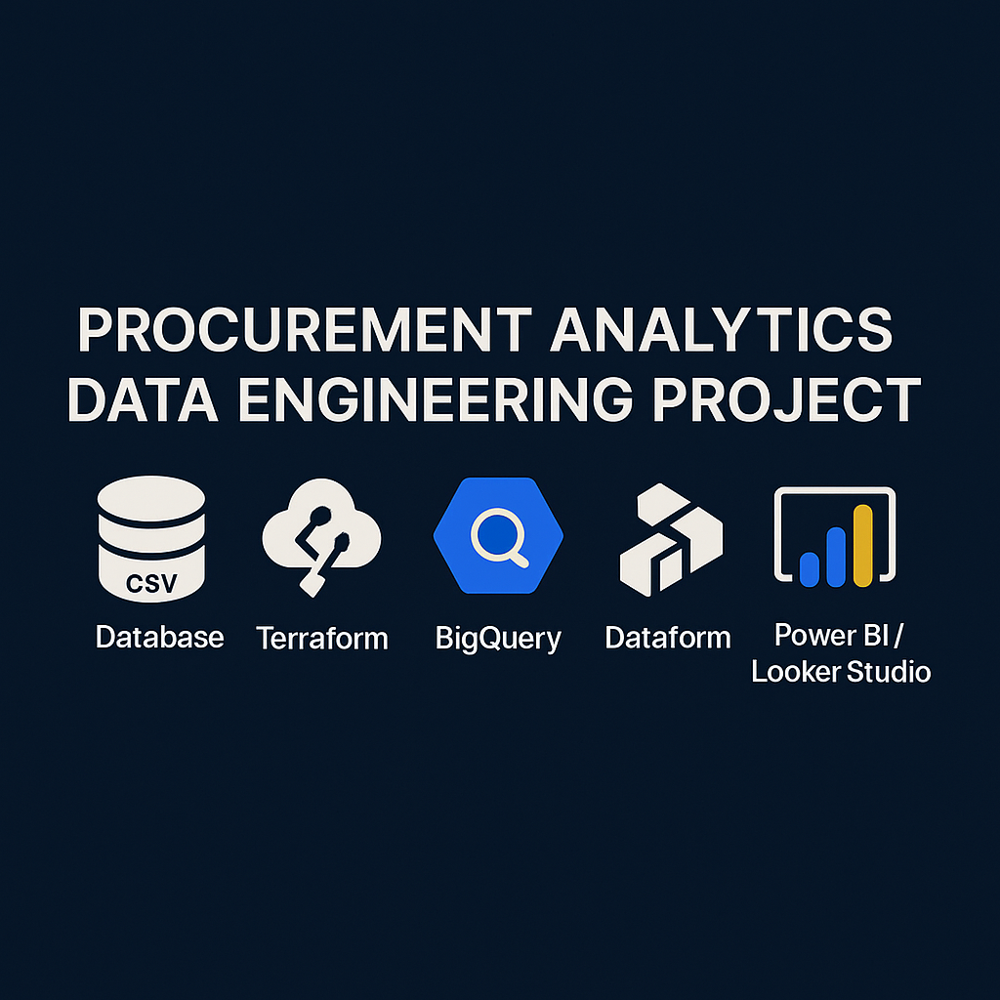

<p align="center">
  
</p>

# 📊 Procurement Analytics Data Engineering Project

Este proyecto demuestra un pipeline de ingeniería de datos completo para analizar el ciclo de compras (SP, OC, entrega) utilizando herramientas modernas como BigQuery, Terraform, Airflow y Dataform.

---

## 🛠 Tecnologías utilizadas

- Google Cloud Platform (BigQuery, Cloud Functions, Cloud Storage)
- Terraform
- Dataform
- Apache Airflow (Cloud Composer)
- Power BI / Looker Studio

---

## 🔄 Flujo de datos

1. **Ingesta**: Archivos CSV simulados de SAP (`EBAN`, `EKPO`, `EKET`) se cargan a Cloud Storage.
2. **Procesamiento**: Cloud Function sube los datos a BigQuery.
3. **Modelado**: Dataform transforma y modela los datos para analítica.
4. **Orquestación**: Airflow ejecuta el pipeline de forma automatizada.
5. **Visualización**: Dashboard en Power BI.

---

## 📁 Estructura del Proyecto

```
data-engineering-procurement-analytics/
├── README.md
├── data/
├── terraform/
├── dataform/
├── dags/
├── cloudfunctions/
│   └── upload_to_gcs/
│       ├── main.py
│       └── requirements.txt
├── docs/
└── dashboard/
```

---

## 🚀 ¿Cómo ejecutarlo?

1. Crea un proyecto GCP y habilita BigQuery, Cloud Storage y Cloud Functions.
2. Despliega la infraestructura con Terraform.
3. Sube archivos de datos a GCS.
4. Ejecuta los DAGs de Airflow.
5. Visualiza los resultados en Power BI o Looker Studio.

---

## 📥 Ingesta de archivos CSV a Google Cloud Storage (GCS)

Para automatizar la carga de los archivos `eban.csv`, `ekpo.csv` y `eket.csv` desde la carpeta `/data` local hacia un bucket en GCS, se creó una **Cloud Function** en Python que utiliza la librería oficial `google-cloud-storage`.

### 📁 Estructura del módulo

```
cloudfunctions/
└── upload_to_gcs/
    ├── main.py
    └── requirements.txt
```

### ⚙️ Requisitos previos

1. Tener el SDK de Google Cloud instalado:  
   👉 https://cloud.google.com/sdk/docs/install

2. Autenticarse en tu cuenta de GCP:

```bash
gcloud auth application-default login
```

3. Instalar dependencias:

```bash
pip install -r cloudfunctions/upload_to_gcs/requirements.txt
```

4. Ejecutar la función:

```bash
python cloudfunctions/upload_to_gcs/main.py
```

---

## 🪣 Crear un bucket en Google Cloud Storage (GCS)

Puedes hacerlo de dos formas:

### ✅ Opción 1: Usar Terraform

Archivo `terraform/main.tf`:

```hcl
provider "google" {
  project = "TU_ID_PROYECTO"
  region  = "us-central1"
}

resource "google_storage_bucket" "procurement_data_bucket" {
  name     = "bucket-procurement-analytics"
  location = "US"
}
```

### ✅ Ejecución en terminal:

```bash
cd terraform
terraform init
terraform apply
```

### ✅ Opción 2: Desde la consola GCP

1. Ve a https://console.cloud.google.com/storage/browser
2. Clic en "Crear bucket"
3. Nombre: `bucket-procurement-analytics`
4. Región: `US`
5. Opciones por defecto → Crear

---

## 🧱 Modelado de Datos con Dataform (BigQuery)

Este proyecto utiliza **Dataform** para transformar los datos brutos cargados en BigQuery en tablas limpias, normalizadas y validadas, listas para análisis de KPIs.

### 📁 Estructura del módulo

```
dataform/
├── dataform.json
└── definitions/
    ├── models/
    │   ├── compras.sqlx
    │   ├── resumen_oc.sqlx
    │   └── calidad_datos.assertion.sqlx
    └── includes/
        └── helpers.js
```

### ⚙️ Requisitos

1. Tener Node.js y npm
2. Instalar el CLI de Dataform:

```bash
npm install -g @dataform/cli
```

3. Autenticarse en GCP:

```bash
gcloud auth application-default login
```

### 🔧 Configuración básica (`dataform.json`)

```json
{
  "warehouse": "bigquery",
  "defaultSchema": "procurement_analytics",
  "assertionSchema": "procurement_analytics_assertions",
  "defaultDatabase": "TU_PROYECTO_ID",
  "gcloudProjectId": "TU_PROYECTO_ID",
  "defaultDataset": "procurement_analytics",
  "assertionDataset": "procurement_analytics_assertions"
}
```

> Reemplaza `TU_PROYECTO_ID` por el ID de tu proyecto en GCP.

### ▶️ Ejecución de modelos

```bash
cd dataform
dataform install
dataform run
```

---

## 📊 Ejemplo de KPIs

- Valor estimado vs real por proveedor
- SP/OC por estado
- Tiempo promedio del ciclo de compra
- Alertas por desviación presupuestaria

---

**Autor**: Jonathan Tejo  
**Licencia**: MIT

## 🔁 Orquestación con Airflow

Para automatizar el pipeline completo (desde la ingesta hasta el modelado), se implementó un **DAG en Apache Airflow** que ejecuta las tareas clave de este proyecto.

### 📄 Archivo del DAG

```
dags/
└── ingest_procurement_dag.py
```

### 📋 ¿Qué hace este DAG?

- Registra el inicio del proceso (`start`)
- Ejecuta el comando `dataform run` para transformar los datos en BigQuery
- Ejecuta una validación final (`validate`)
- Registra el fin del proceso (`end`)

### 🧱 Estructura del DAG

```python
start >> dataform_run >> validate >> end
```

### 📅 Frecuencia de ejecución

Este DAG está configurado para ejecutarse una vez al día (`@daily`), pero puedes ajustar `schedule_interval` según tus necesidades.

### ▶️ Cómo ejecutar (modo local)

1. Copia el archivo `ingest_procurement_dag.py` a tu carpeta `dags/` de Airflow.
2. Asegúrate de que tu entorno Airflow tenga acceso a:
   - Dataform instalado globalmente (`npm install -g @dataform/cli`)
   - Autenticación de GCP configurada (`gcloud auth application-default login`)
3. Inicia Airflow webserver y scheduler:

```bash
airflow webserver &
airflow scheduler
```

4. Activa el DAG desde la interfaz web de Airflow (http://localhost:8080).

---
